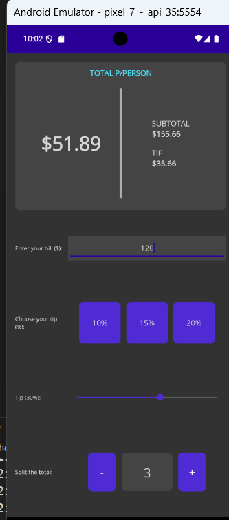

# Exercice 2

## Objectifs

Réaliser une application permettant de calculer la part à payer pour un groupe d'individus lorsqu'ils vont au restaurant. 

L'application devra permettre, au moyen de son interface, d'entrer la somme à payer, le nombre de participants et de sélectionner le pourcentage de pourboire laissé au serveur.

L'ensemble sera ainsi additionné puis divisé entre les individus et offrira la valeur à payer pour chaque personne dans l'affichage supérieur de l'application. 

## Affichage 

