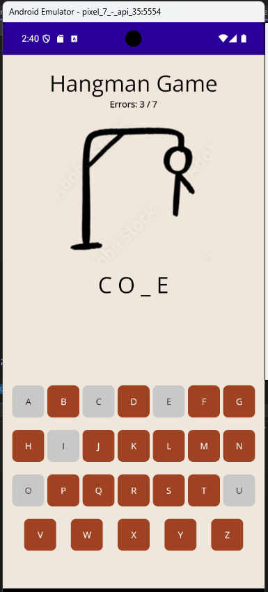

# Exercice 04 - Pendu

Réaliser via .NET MAUI une application permettant de jouer au jeu du Pendu. 

Ce jeu offrira aux joueurs 7 vies pour trouver un mot aléatoire généré par l'application (dont la liste des mots possible proviendra d'un fichier). Il disposera d'un affichage progressif dont l'évolution dépendra du nombre de vies restantes au joueur. Pour entrer le mot, le joueur devra utiliser une série de bouton et non le clavier intégré au téléphone. L'affichage s'adaptera automatiquement au fur et à mesure d'une partie. 

**BONUS**: Générer les boutons via une variable textuelle et faire en sorte que les lettres se grisent lors de leur utilisation (afin d'éviter l'appui à plusieur reprise sur celles-ci).

## Affichage

## Ressources 

- [Dossier Zip contenant les images](./assets/ex04/images.zip)