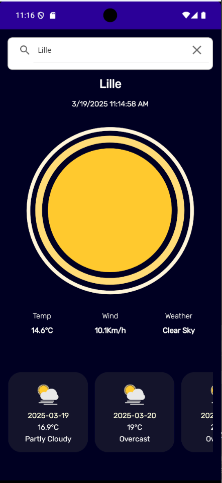

# Exercice 5 - Weather App

Réaliser via .NET MAUI une application permettant de consulter la météo. 

L'application offrira à l'utilisateur la possibilité de saisir le nom d'une ville et de confirmer son choix. Un appel API sera ensuite effectué vers [Weather API](https://open-meteo.com/en/docs). 

L'affichage de la météo se fera via des fichiers Lottie, permettant des animations (N'oubliez pas le package NuGet pour pouvoir les afficher : `SkiaSharp.Extended.UI.Maui`).

**BONUS**: Il devra être possible d'avoir plusieurs jours de forecast, en plus de la météo actuelle. Ces différentes journées seront présentées en bas de l'affichage via une `<CollectionView>` horizontalle.

## Astuces 

Pour obtenir la position en longitude et latitude d'une ville dans le monde, vous pouvez utiliser ces instructions en .NET: 

```c#
 private async Task<Location> GetCoordinatesAsync(string address)
 {
     IEnumerable<Location> locations = await Geocoding
          .Default.GetLocationsAsync(address);

     Location location = locations?.FirstOrDefault();

     return location;
 }
```

## Affichage



## Ressources 

- [Dossier Zip contenant les animations](./assets/ex05/lottiefiles.zip)